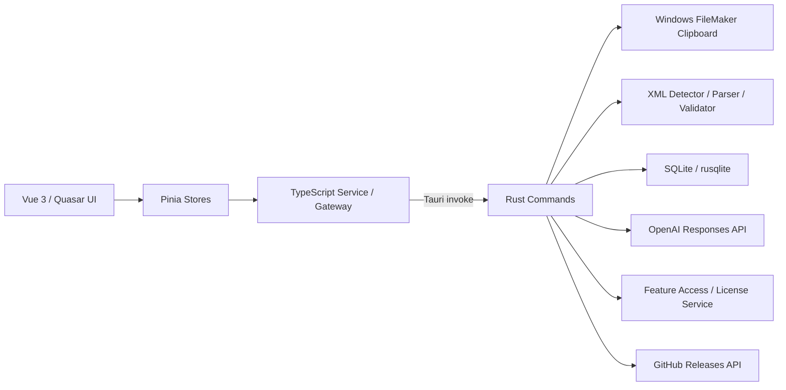

# Vertex FM ENGINE 技術仕様書

| 項目 | 内容 |
|---|---|
| 製品名 | Vertex FM Engine |
| 現在のバージョン | 0.1.0 |
| 文書版 | 1.0 |
| 更新日 | 2026-08-26 |
| 主対象OS | Windows 10/11（64-bit） |
| アプリケーション形態 | Tauri 2によるネイティブデスクトップアプリケーション |
| リポジトリ | `ACE-FRDS/vrtex_fm_engine` |

## 1. 製品概要

Vertex FM Engineは、FileMaker ProのXML Clipboardデータを取得・解析・編集・検証・再送信し、履歴、ライブラリ、コレクション、AI支援、Knowledge Pack、リレーションシップ設計を一つのワークスペースで扱う開発支援IDEです。

フロントエンドをWeb技術で構築し、FileMaker Clipboard、SQLite、資格情報、ファイル操作などOS依存機能をRust製のTauriバックエンドが担当します。同じUIをブラウザ開発モードでも確認できますが、FileMaker Clipboardなどのネイティブ機能はTauri実行時のみ利用できます。

## 2. 使用言語

| 言語・形式 | 主な用途 |
|---|---|
| TypeScript 5.8 | UIロジック、状態管理、サービス層、ドメインモデル、FileMaker XML解析補助 |
| Vue Single File Component | 画面、コンポーネント、テンプレート、コンポーネント単位のスタイル |
| Rust 2021 Edition | ネイティブAPI、Clipboard、SQLite、XML検証、AI通信、ライセンス制御、更新確認 |
| SCSS / CSS | テーマ、レイアウト、レスポンシブ表示、12種類の配色、テーマ連動カーソル |
| SQL | SQLiteスキーマ、マイグレーション、履歴・ライブラリ・AI・Knowledgeデータ |
| HTML | Viteのエントリーポイント |
| JSON | Tauri設定、Capability、アプリ内データ交換 |
| TOML | Rustクレートとビルド依存関係 |
| SVG | 製品ロゴ、ナレッジアイコン、テーマ連動カーソル |

## 3. 採用技術とバージョン

### 3.1 フロントエンド

| 技術 | バージョン | 役割 |
|---|---:|---|
| Vue | 3.5.18系 | SPA UIとComposition API |
| TypeScript | 5.8.3系 | 静的型検査 |
| Vite | 7.1.2系 | 開発サーバー、HMR、本番ビルド |
| Pinia | 3.0.3系 | アプリケーション状態管理 |
| Quasar | 2.18.2系 | ボタン、ダイアログ等のUI基盤 |
| Monaco Editor | 0.52.2系 | XMLコード編集、表示、差分確認 |
| Sass Embedded | 1.90.0系 | SCSSコンパイル |
| Material Icons / Quasar Extras | 1.16.17系 | UIアイコン |

### 3.2 ネイティブバックエンド

| 技術・クレート | バージョン | 役割 |
|---|---:|---|
| Tauri | 2系 | Web UIとネイティブ機能の統合、配布パッケージ生成 |
| rusqlite | 0.32 | SQLite永続化。SQLite本体をバンドル |
| roxmltree | 0.20 | XML構文解析 |
| reqwest | 0.12 | OpenAI API、GitHub Releases APIへのHTTPS通信 |
| serde / serde_json | 1系 | Rust・TypeScript間のデータシリアライズ |
| chrono | 0.4 | 日時、ライセンス期限、履歴時刻 |
| sha2 | 0.10 | Clipboardアイテムのチェックサム |
| uuid | 1系 | レコード識別子生成 |
| thiserror | 2系 | ネイティブエラー定義 |
| windows-sys | 0.59 | Windows Clipboard、プロセス検出、保護ストレージ |
| rustls | reqwest機能 | TLS通信。OpenSSLへの外部依存を避ける構成 |

## 4. システム構成



### 4.1 レイヤーの責務

- UI層：画面表示、入力、選択状態、ダイアログ、通知、テーマ。
- Store層：Clipboard、Library、Collection、Editor、AI、設定、デザイナー等の状態管理。
- Service / Gateway層：UIとTauriコマンド間の境界。ブラウザプレビュー時のフォールバックも担当。
- Rust Command層：外部から呼び出せるネイティブAPI。入力検証後に各ドメインへ処理を委譲。
- Domain層：FileMaker XML、AI設計、リレーション、Knowledge、ライセンスなどの業務ルール。
- Persistence層：SQLite Repositoryとバージョン管理されたSQLマイグレーション。

## 5. フロントエンド構成

### 5.1 主なワークスペース

| ワークスペース | 概要 |
|---|---|
| クリップボード | FileMaker XMLの取得、履歴選択、編集、検証、再送信 |
| ライブラリ | 再利用するClipboardアイテムの保存、検索、お気に入り |
| コレクション | Project単位の分類、種類別ツリー、件数集計 |
| Codex / AI | AIセッション、プロンプト、RAG検索、Dry Run、生成結果 |
| ナレッジ | FileMaker Knowledge BaseとKnowledge Pack Builder |
| デザイナー | テーブルオカレンスとリレーションシップ設計 |
| ツール | XML検証、形式判定、差分、構造表示等 |
| 設定 | 一般設定、Codex連携、データ管理、テーマ、言語、カーソル |
| ドキュメント | 製品概要、操作方法、連携手順 |

### 5.2 状態管理

Pinia Storeを機能ごとに分割しています。

- `clipboard`：現在のXML、履歴、選択アイテム、コレクション。
- `editor`：Monaco Editor、差分、タブ、検証状態。
- `library`：ライブラリアイテム、タグ、検索、並び順。
- `collectionWorkspace`：Projectと種類別集計。
- `aiAssistant`：セッション、メッセージ、AI実行状態。
- `relationshipDesigner`：TO、フィールド、リレーション、座標、選択状態。
- `settings`：テーマ、文字サイズ、言語、Clipboard監視、テーマカーソル。
- `navigation`：上部メニューとSPA内の表示切替。

### 5.3 UI仕様

- 画面遷移はVue内の状態切替によるSingle Page Application方式。
- 初期ウィンドウは1920 × 1200、最小1180 × 720、中央表示。
- Monaco EditorでXML編集、ミニマップ、差分、構造、プレビューを提供。
- 日本語を標準言語とし、英語切替を保持。
- Defaultを含む12種類のテーマを4列3行で表示。
- 暗色テーマと明色パステルテーマの双方に対応。
- テーマアクセントはメニュー、Clipboardカード、ナレッジ、デザイナー、カーソルへ連動。
- テーマ連動カーソルをオフにするとWindows標準カーソルへ戻る。

## 6. FileMaker Clipboard仕様

### 6.1 対応形式

| 内部形式 | Windows Clipboard形式 | 主な対象 |
|---|---|---|
| XMSC | Mac-XMSC | スクリプト、複数スクリプト |
| XMSS | Mac-XMSS | スクリプトステップ、複数ステップ |
| XMTB | Mac-XMTB | テーブル、複数テーブル |
| XMFD | Mac-XMFD | フィールド |
| XML2 | Mac-XML2 | レイアウトオブジェクト |

未知の形式も`Mac-`接頭辞を保持したまま扱える開放的な形式変換にしています。

### 6.2 バイナリ構造

FileMakerのWindows Clipboardデータは次の構造で読み書きします。

1. 先頭4 bytes：XML本文のbyte長を示すLittle Endian `u32`。
2. 5 byte目以降：UTF-8 XML本文。
3. 書込前にXML構文と想定FileMaker形式を検証。
4. 検証エラー時はOS Clipboardを変更せず処理を中止。

### 6.3 監視と通知

- Clipboard監視は設定で有効・無効を切替。
- 取得成功、Clipboardセット完了、取得失敗を画面下部中央の通知で表示。
- ネイティブ取得はWindows APIをRustから直接呼び出すため、外部コマンドの定期起動を必要としません。

## 7. XML処理

Rust側にDetector、Parser、Schema、Validator、Previewを分離しています。

- ルート`fmxmlsnippet type="FMObjectList"`の確認。
- 要素構造からClipboard形式とオブジェクト種別を判定。
- XMLの整形式、必須属性、FileMaker固有ルールを検証。
- 複数Script、複数Table等のオブジェクト数を判定。
- FileMakerへ送信する前に検証を必須化。
- 元XMLを保持し、編集差分とプレビューを表示。
- SHA-256チェックサムにより重複検出と変更管理を補助。

## 8. データ永続化

### 8.1 SQLite

- データベース名：`vertex-fm-engine.db`
- 保存場所：Tauriが返すアプリケーションデータディレクトリ。
- Foreign Key：有効。
- Journal Mode：WAL。
- スキーマは`schema_migrations`でバージョン管理。

### 8.2 主なデータ

- Clipboard履歴、ライブラリ、お気に入り、メモ、使用日時。
- コレクションとClipboardアイテムの割当。
- タグとClipboardアイテムの関連。
- XML編集リビジョン。
- AIセッション、AIメッセージ、RAG文書。
- Knowledge Pack、検証済み知識、設計規則。
- アプリケーション設定。

履歴削除時は、ライブラリまたはお気に入りとして保存された資産を保持する設計です。データ管理画面から「ライブラリ削除」「クリップボード削除」「すべて削除」を個別に実行できます。

### 8.3 ワークスペースファイル

- 拡張子：`.vfe-workspace`
- 最大サイズ：128 MB。
- 保存先は絶対パスのみ許可。
- 保存先フォルダーが存在することをRust側で検証。
- クライアントへProject状態を持ち出し、再度読み込むための独自形式。

## 9. AI・RAG・Knowledge

### 9.1 AI Provider

- ProviderインターフェースによりAI接続先を抽象化。
- 現在の実通信：OpenAI Responses API `POST /v1/responses`。
- 接続確認：OpenAI Models API。
- API応答は保存無効（`store: false`）で送信。
- Providerエラー内のAPIキーらしい文字列をマスク。
- Codex App Serverは境界のみ用意されており、Transport接続は今後の工程。

### 9.2 認証情報

- OpenAI APIキーはWindows保護ストレージ、または`OPENAI_API_KEY`から解決。
- UIやSQLiteへ平文APIキーを保存しない。
- キーの登録・削除・接続確認はTauriデスクトップ実行時のみ許可。

### 9.3 RAG

- SQLiteの`rag_documents`へFileMaker仕様、Projectルール、安全規則を保存。
- タイトル、本文、タグ、Source Typeを検索対象とする。
- AI実行時に関連文書をプロンプトへ付加。
- ブラウザプレビューではLocal Storageによる開発用フォールバックを使用。

### 9.4 Knowledge Pack

- FileMaker XML、テーブル、フィールド、Script、計算式、命名、検証、リレーション設計等のKnowledge Packを保持。
- Official Packは直接編集・削除できず、複製してカスタマイズ。
- Knowledge Pack Builder、Knowledge Base編集、学習、Import / ExportはPro機能。
- Proライセンス失効時も既存データを削除せず、再有効化までロックする方針。

## 10. Relationship Designer

- Base TableとTable Occurrenceを区別した設計モデル。
- TOの移動、複数選択、領域選択、整列、等間隔、自動配置。
- フィールド間のリレーション作成と演算子管理。
- リレーション線のダブルクリックによる編集ダイアログ。
- TO名変更、サイズ変更、フィールド領域スクロール。
- 自己参照時の追加TO生成。
- 設計検証、孤立TO、循環、フィールド型、参照整合性を検査するドメイン層。
- Relationship DesignerはPro FeatureとしてUI層とService層の双方で制御。

## 11. ライセンスとFeature Access

単一コードベースでFree、Pro、Developmentを切り替えます。別アプリへ分岐しません。

- Debugビルド：Developmentライセンス。
- Releaseビルド：検証済みPro Providerがない限りFreeへFail Closed。
- UIだけでなくRust Service層でも`require(feature)`を実行。
- ライセンス状態は再取得可能で、状態変更へ追従する境界を用意。
- 期限切れまたは無効時は対象機能を実行不可とし、データは保持。

主なPro Feature Key：

- `relationshipDesigner`
- `tableOccurrenceCanvas`
- `relationshipGraph`
- `autoArrange`
- `relationshipInspector`
- `projectSnapshot`
- `designTemplates`
- `layoutDesigner`
- `knowledgePackEngine`
- `knowledgePackBuilder`
- `fileMakerKnowledgeBase`
- `knowledgeLearning`
- `repairLearning`
- `knowledgeImportExport`

## 12. セキュリティ仕様

- Tauri Capabilityはメインウィンドウに`core:default`と保存ダイアログのみを許可。
- FileMaker Clipboard書込前にXML検証。
- ワークスペース保存先、拡張子、サイズをRust側で再検証。
- SQLite Foreign KeyとMigrationを有効化。
- APIキーはOS保護領域を優先し、ログ・UI・エラーでの露出を抑止。
- AI生成物はDry Run、検証、差分、承認を経てからFileMakerへ送信する設計。
- Pro機能はUI非表示だけに依存せず、Service層でもFeature判定。
- 本番ライセンスは未検証状態をProとして扱わないFail Closed方式。

現在のTauri CSPは開発上の理由から`null`です。本番リリース前に必要な接続先、画像、フォント、WebSocketを明示したCSPへ制限することを推奨します。

## 13. 更新確認

- GitHub Releases APIから`ACE-FRDS/vrtex_fm_engine`の最新Releaseを取得。
- 現在バージョンとReleaseタグを数値比較。
- Privateリポジトリへアクセスする場合は`VFE_GITHUB_TOKEN`を利用可能。
- 現状は更新情報とRelease URLの表示が中心で、自動バイナリ置換は別工程。

## 14. 開発環境

### 14.1 必須環境

- Node.js 20以降。
- pnpm。
- Rust stable。
- Windows MSVC Toolchain。
- Microsoft Edge WebView2 Runtime。
- ネイティブClipboard試験を行う場合はFileMaker Pro。

### 14.2 開発起動

```powershell
pnpm install
pnpm run tauri dev
```

UIのみを確認する場合：

```powershell
pnpm run dev
```

Vite開発サーバーは`http://localhost:1420`を使用し、HMRは1421を使用します。

## 15. ビルドと試験

### 15.1 フロントエンド

```powershell
pnpm run build
```

内部では次を順番に実行します。

1. `vue-tsc --noEmit`によるVue / TypeScript型検査。
2. `vite build`による本番アセット生成。

### 15.2 Rust

```powershell
Set-Location src-tauri
cargo test
```

### 15.3 デスクトップ配布パッケージ

```powershell
pnpm run tauri build
```

TauriのBundle設定に従ってWindows Installerを生成します。リリース前には型検査、フロントエンドビルド、Rust Unit Test、Clipboard取得・貼付、SQLite Migration、Free / Pro Feature Gateを総合試験します。

## 16. ブラウザプレビューとネイティブ版の差異

| 機能 | ブラウザプレビュー | Tauriデスクトップ版 |
|---|---|---|
| UI・テーマ・エディター | 利用可能 | 利用可能 |
| FileMaker Clipboard | 利用不可 | 利用可能 |
| SQLite | Local Storage等のフォールバック | SQLite |
| APIキー保護保存 | 利用不可 | Windows保護ストレージ |
| OpenAI実通信 | 利用不可 | 利用可能 |
| ワークスペースファイル | 制限あり | ネイティブ保存・読込 |
| FileMakerプロセス検出 | 利用不可 | 利用可能 |

## 17. 現在の実装上の留意事項

- 主対象はWindowsです。macOS用Clipboard Providerのモジュールはありますが、正式対応には実機総合試験が必要です。
- Codex App Server連携はProvider境界までで、実Transportは未接続です。
- 自動アップデートは更新情報確認までで、署名済みInstallerの自動適用は未実装です。
- 本番Proライセンスは署名済みライセンスファイルまたはオンラインProviderへ置換可能な境界を実装済みですが、正式な発行・検証基盤は別途必要です。
- 本番リリースではCSP設定、コード署名、Installer署名、ライセンス署名、バックアップ・復元試験を完了する必要があります。

## 18. 主要ソース配置

```text
docs/                アーキテクチャ、仕様、設計判断、開発資料
scripts/             検証等の開発補助スクリプト
tests/               リポジトリ横断テストとE2E試験の配置先

src/
  components/       Vue UIコンポーネント
  domain/           設計・検証ドメイン
  services/         Tauri Gateway、AI、Feature Access
  stores/           Pinia状態管理
  styles/           全体テーマとレイアウト
  types/            TypeScript型定義
  utils/            XML整形、命名補助

src-tauri/
  migrations/       SQLite Migration SQL
  src/ai/            AI Provider、資格情報、プロンプト
  src/clipboard/     Windows / macOS Clipboard Provider
  src/commands/      Tauri公開コマンド
  src/database/      Repository、Model、Migration実行
  src/xml/           XML判定、解析、検証、プレビュー
  src/license.rs     ネイティブFeature Access
```

Community APIは別配備単位であるため、`ACE-FRDS/vrtex_fm_engine_community_api`で独立管理します。Installerと配布成果物もSource Repository外のBuilds / Releases領域で管理します。

---

この文書は2026-08-26時点のプロジェクト構成とソースコードを基準にした現行仕様です。実装変更時は`package.json`、`Cargo.toml`、Tauri Command、Migration、Feature Keyと併せて更新してください。
